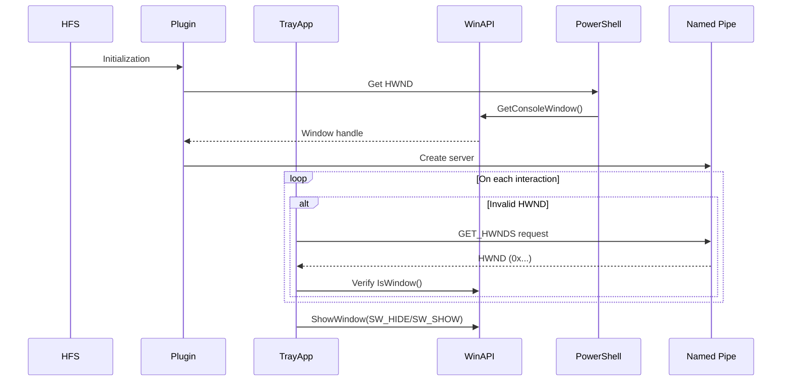

# [HFS-ConsoleHide2Tray](../../releases/)

---

## Project Description

**[HFS-ConsoleHide2Tray](../../releases/)** is a tool for managing the console of **HTTP File Server version 3 (HFS 3)**, enabling its **minimization to the system tray**. Reliably hides the HFS console using **Named Pipes**. Consists of two components:
  - **HFS Plugin** (retrieves and transmits window handles).
  - **Native Application** (C++ tray manager).

**No installation required** — operates in portable mode.

---

## Key Features

### HFS Console Management
* **Automatically hides the console** when the app starts.
* **Quick visibility toggle** via the tray icon:
  * Double left-click.
  * Context menu: "**Hide/Show HFS Console**".
* **Windows 11 ConPTY support (CASCADIA_HOSTING_WINDOW_CLASS)**. Handles **HWND** changes when dragging console tabs.

---

## Technical Specifications

* **Architecture**:
  - **Agent**: HFS plugin in **JavaScript** (Node.js).
  - **Tray Manager**: Native **C++** application.
* **System Integration**:
  - **WinAPI** for window management (`ShowWindow`).
  - **Shell API** for tray operations (`Shell_NotifyIcon`).
  - Windows message processing (`WndProc`).
* **Security**:
  - Works exclusively with **local HFS processes**.
  - No network calls.
* **Libraries**:
  - `user32.lib` (window management)
  - `Shell32.lib` (system tray)

---

---

## Plugin Installation
1. Copy the plugin folder to `\plugins` in your **HFS** directory.
2. **Activate** the plugin via the HFS web interface.

---

## Requirements

* **Server**:
  - **HTTP File Server v3**
  - Installed **[ConsoleHide2Tray-agent](../../releases/)** plugin.
* **Client**:
  - **Windows 7** or newer.

---
Support:
* BTC: `bc1qeuq7s8w0x7ma59mwd4gtj7e9rjl2g9xqvxdsl6`
* TON: `UQAOQXGtTi_aM1u54aQjb8QiXZkQdaL9MDSky5LHN0F5-yF2`
